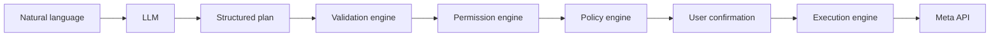

# AI Architecture

```mermaid
flowchart LR
  NL[Natural language] --> LLM[LLM]
  LLM --> PLAN[Structured plan]
  PLAN --> VAL[Validation engine]
  VAL --> PERM[Permission engine]
  PERM --> POL[Policy engine]
  POL --> CONF[User confirmation]
  CONF --> EXE[Execution engine]
  EXE --> META[Meta API]
```

Provider-neutral `AIProvider` interface + rule-based fallback. Never LLM → arbitrary call.
