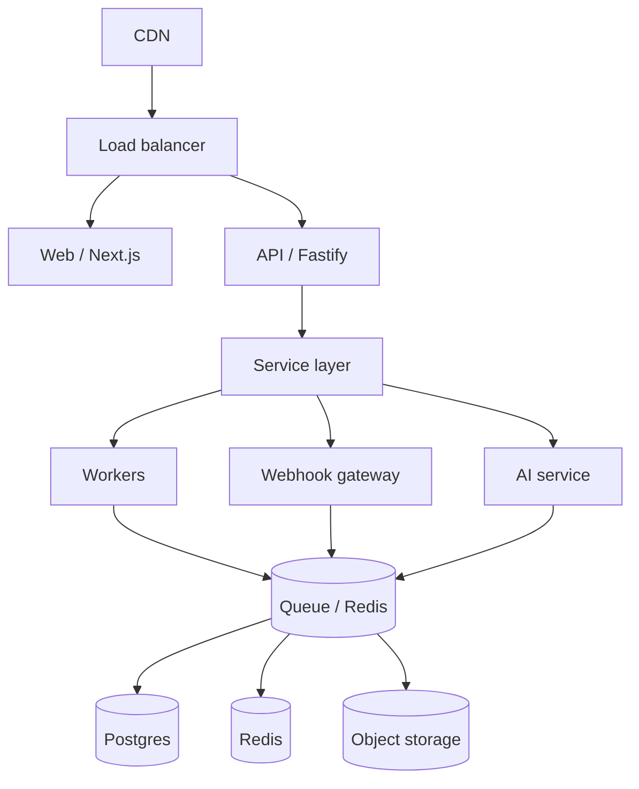

# Architecture

```mermaid
flowchart TB
  CDN --> LB[Load balancer]
  LB --> WEB[Web / Next.js]
  LB --> API[API / Fastify]
  API --> SVC[Service layer]
  SVC --> W[Workers]
  SVC --> WH[Webhook gateway]
  SVC --> AI[AI service]
  W & WH & AI --> Q[(Queue / Redis)]
  Q --> DB[(Postgres)]
  Q --> R[(Redis)]
  Q --> S[(Object storage)]
```

Modular monolith: `apps/*` are deployables, `packages/*` are domain modules.
Extract services only on demonstrated scaling/ownership need.
